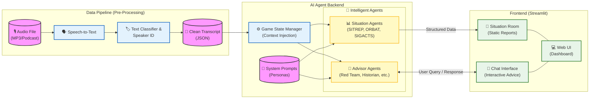

```mermaid
graph LR
    %% Styling
    classDef storage fill:#f9f,stroke:#333,stroke-width:2px;
    classDef process fill:#e3f2fd,stroke:#1565c0,stroke-width:2px;
    classDef agents fill:#fff9c4,stroke:#fbc02d,stroke-width:2px;
    classDef ui fill:#e8f5e9,stroke:#2e7d32,stroke-width:2px;

    subgraph "Data Pipeline (Pre-Processing)"
        direction TB
        A[("🎙️ Audio File\n(MP3/Podcast)")]:::storage
        B["🗣️ Speech-to-Text"]:::process
        C["🏷️ Text Classifier &\nSpeaker ID"]:::process
        D[("📄 Clean Transcript\n(JSON)")]:::storage
        
        A --> B --> C --> D
    end

    subgraph "AI Agent Backend"
        direction TB
        E["⚙️ Game State Manager\n(Context Injection)"]:::process
        
        subgraph "🤖 Intelligent Agents"
            F["📊 Situation Agents\n(SITREP, ORBAT, SIGACTS)"]:::agents
            G["🧠 Advisor Agents\n(Red Team, Historian, etc.)"]:::agents
        end
        
        H[("📜 System Prompts\n(Personas)")]:::storage
        
        D --> E
        E --> F
        E --> G
        H --> F & G
    end

    subgraph "Frontend (Streamlit)"
        direction TB
        I["💻 Web UI\n(Dashboard)"]:::ui
        J["📂 Situation Room\n(Static Reports)"]:::ui
        K["💬 Chat Interface\n(Interactive Advice)"]:::ui
        
        F -->|"Structured Data"| J
        G <-->|"User Query / Response"| K
        J --- I
        K --- I
    end
```
