# The AI Wargamer: Decision Support MVP

This application is a Minimum Viable Product (MVP) designed to demonstrate how artificial intelligence agents could support human decision-makers during a fast-moving, high-stress crisis. The scenario is based on Series 2 of the Sky News / Tortoise Media podcast, "The Wargame". 

This MVP was developed in a one-day hackathon.


## Scenario Overview

The Wargame is a groundbreaking podcast series that places real-world British figures—former Cabinet Ministers, intelligence officials, and military chiefs—into a simulated, high-stakes national crisis. Series 2 of the podcast simulates a scenario where the UK is attacked by Russia, rapidly escalating into a full-scale war. The players, forming an emergency Cabinet known as COBRA, must make critical, agonizing decisions under immense pressure.

The goal of this AI Decision Support MVP is to move the human player from processing raw data to making informed, strategic choices, reducing their cognitive burden and creating more time for them to think. The AI Agents are designed not to replace human judgement but to summarise and prompt thinking for factors the human player may overlook, provide alternative points of view and counter unconcious biases.

## System Architecture

The app is for demonstration purposes only; it doesn't yet implement the full pipeline from input audio to output text from the agents. The following diagram shows a rough idea for how the full system could be implemented.



## Features

*   **Interactive Dashboard**: A [Streamlit](https://streamlit.io/) web application for visualizing scenario data and AI-generated intelligence.
*   **Situation Room**: Provides static, pre-computed reports generated by AI agents, including:
    *   Situation Report (SITREP)
    *   Significant Acts (SIGACTS)
    *   Order of Battle (ORBAT)
    *   Key Actions, Uncertainties, and Dilemmas
*   **AI Advisors**: A panel of interactive chatbots, each with a unique persona (e.g., Red Teamer, Military Historian), ready to answer questions based on the full context of the wargame transcripts.
*   **Data Visualization**: Includes an interactive transcript viewer and a knowledge graph exploring the relationships between entities in the scenario.
*   **Cached Intelligence**: The application uses pre-computed analysis to load quickly and reduce reliance on expensive real-time AI calls for static reports.

## Getting Started

### Prerequisites

*   Python 3.9+
*   Google Cloud SDK authenticated with a project that has the Vertex AI API enabled.

### Installation

1.  **Clone the repository:**
    ```bash
    git clone https://github.com/your-username/ai_wargamer_SCC.git
    cd ai_wargamer_SCC
    ```

2.  **Create a virtual environment and install dependencies:**
    ```bash
    python -m venv .venv
    source .venv/bin/activate
    pip install -r requirements.txt
    ```

### Running the Application

The application runs in two stages. First, you must run a script to pre-compute the AI analysis. Then, you can launch the interactive web application.

1.  **Pre-compute Intelligence:**
    This script reads the podcast transcripts, sends them to the Google Vertex AI models to generate reports and briefings, and saves the output to a local JSON file.

    ```bash
    python precompute_intelligence.py
    ```
    This will create a file named `intelligence_analysis_gemini3.json`. For the web app to find it, rename it: 
    
    ```bash
    mv intelligence_analysis_gemini3.json intelligence_analysis.json
    ```

2.  **Launch the Streamlit Web App:**
    ```bash
    streamlit run web_app.py
    ```

    The application should now be open and accessible in your web browser.

## Project Structure

```
├─── web_app.py                  # Main Streamlit application frontend
├─── precompute_intelligence.py    # Script to run AI analysis and cache results
├─── agents.py                   # Defines AI agent personas and interaction with Vertex AI
├─── game_state.py               # Manages the state and context of the wargame
├─── requirements.txt            # Python dependencies
├─── wargame_scenario.md         # Source content for the scenario overview
├─── intelligence_analysis.json  # Pre-computed AI analysis (generated)
├─── .streamlit/
│   └─── config.toml             # Streamlit configuration
├─── data/                       # Raw and cleaned transcript data from the podcast
├─── prompts/                    # System prompts and outlines for the AI agents
└─── images/                     # Screenshots and diagrams for the UI and README
└─── ...
```