# The Wargame: AI Decision Support MVP

ALL THE INFORMATION IN THIS APP IS BASED ON A FICTIONAL WARGAME. 

This application is a Minimum Viable Product (MVP) designed to demonstrate how artificial intelligence agents could support human decision-makers during a fast-moving, high-stress crisis like the Wargame. It was developed in around 4 hours during a hackathon.

## Scenario Overview

The Wargame is a groundbreaking podcast series by Sky News and Tortoise Media that places real-world British figures—former Cabinet Ministers, intelligence officials, and military chiefs—into a simulated, high-stakes national crisis. Series 2 of the podcast simulates a scenario where the UK is attacked by Russia, rapidly escalating into a full-scale war. The players, forming an emergency Cabinet known as COBRA, must make critical, agonizing decisions under immense pressure, dealing with cyber attacks, missile strikes, diplomatic failures, and the specter of nuclear war. This simulation exposes the critical vulnerabilities in UK national resilience and strategy, forcing players to confront trade-offs between military response, civilian safety, and alliance cohesion.

Podcast Episodes (Series 2)

You can listen to the full context of the scenario <a href="https://podcasts.apple.com/gb/podcast/the-wargame/id1547225334" target="_blank" style="color:#007BFF; text-decoration:underline;"> on Apple Podcasts.</a>

## The AI Decision Support MVP

The goal is to move the human player from processing raw data to making informed, strategic choices. Reducing their cognitive burden and creating more time for them to think. The AI Agents are designed not to replace human judgement but to summarise and prompt thinking for factors the human player may overlook, provide alternative points of view and counter unconcious biases.

The AI Agents provide concise, role-specific strategic advice and analysis of raw data (the transcripts) in real-time. This is solely a demonstration project. A real-world system supporting government or military operations would require:

* Careful Design: Integrating human-AI teams effectively.

* Explainable AI (XAI): Ensuring the rationale behind every piece of advice is clear.

* Rigorous Assurance: Extensive testing and verification of AI outputs and constraints.

The app is for demonstration purposes only, it doesn't yet implement the full pipeline from input audio to output text from the agents. The following diagram shows a rough idea for how the full system could be implemented.

```mermaid
graph LR
    %% Styling
    classDef storage fill:#f9f,stroke:#333,stroke-width:2px;
    classDef process fill:#e3f2fd,stroke:#1565c0,stroke-width:2px;
    classDef agents fill:#fff9c4,stroke:#fbc02d,stroke-width:2px;
    classDef ui fill:#e8f5e9,stroke:#2e7d32,stroke-width:2px;

    subgraph "Data Pipeline (Pre-Processing)"
        direction TB
        A[("🎙️ Audio File\n(MP3/Podcast)")]:::storage
        B["🗣️ Speech-to-Text"]:::process
        C["🏷️ Text Classifier &\nSpeaker ID"]:::process
        D[("📄 Clean Transcript\n(JSON)")]:::storage
        
        A --> B --> C --> D
    end

    subgraph "AI Agent Backend"
        direction TB
        E["⚙️ Game State Manager\n(Context Injection)"]:::process
        
        subgraph "🤖 Intelligent Agents"
            F["📊 Situation Agents\n(SITREP, ORBAT, SIGACTS)"]:::agents
            G["🧠 Advisor Agents\n(Red Team, Historian, etc.)"]:::agents
        end
        
        H[("📜 System Prompts\n(Personas)")]:::storage
        
        D --> E
        E --> F
        E --> G
        H --> F & G
    end

    subgraph "Frontend (Streamlit)"
        direction TB
        I["💻 Web UI\n(Dashboard)"]:::ui
        J["📂 Situation Room\n(Static Reports)"]:::ui
        K["💬 Chat Interface\n(Interactive Advice)"]:::ui
        
        F -->|"Structured Data"| J
        G <-->|"User Query / Response"| K
        J --- I
        K --- I
    end
```

